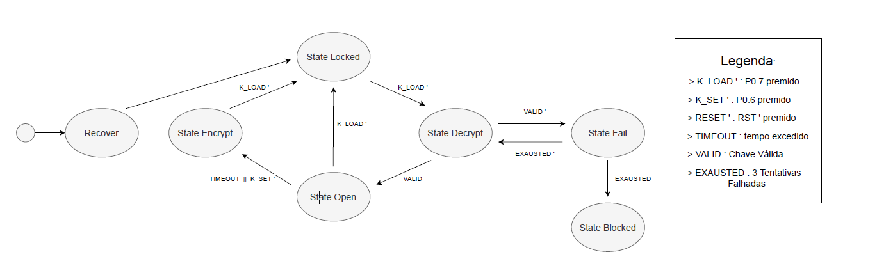

# Eletronic-Lock

## Enunciado
Pretende-se implementar uma fechadura electrónica programável, recorrendo à plataforma Kit8051USB. Este sistema deve operar controlando:
- o display de 7-segmentos que funciona como interface com o utilizador;
- actuando sobre uma tensão de bloqueio num dos portos de E/S (GPIO);
- verificando a autenticidade comparando o código de 4 dígitos de [0-9], que será introduzida através das teclas SET e LOAD (porto 0), com uma chave secreta.

A chave secreta é válida para múltiplas iterações de bloqueio, num intervalo de tempo de 30 segundos após a última abertura. O utilizador terá de redefinir uma nova durante a operação de fecho se o tempo se esgotar ou assim o pretender. O tempo de reutilização da mesma chave é assinalado com o blink num intervalo de 500 ms do ponto decimal no display de 7-segmentos.
Como meio de recuperação de acesso ao sistema, deve existir uma backdoor secreta que permite a reprogramação do mesmo com uma nova chave. Esta funcionalidade será reconhecida como RECOVERY_CONDITION.
Sempre que o sistema recebe uma nova chave secreta, por se tratar de um valor de natureza crítica para o sistema, este valor deve ser encriptado antes de ser armazenado na memória interna, ou seja, este valor nunca pode estar armazenado de forma explícita.
Sempre que o utilizador acede ao sistema e introduz uma chave na entrada, o valor da chave secreta deve ser lido da memória, desencriptado e comparado com a chave introduzida.
No arranque do sistema, o estado inicial é o estado fechado (“Locked”), e para isso o sistema autoconfigura-se com uma chave pré-definida (SEC_KEY). O display de 7-segmentos deve apresentar o caracter “L” sinalizando o estado e uma tensão de bloqueio deve estar presente na saída, de forma permanente.
O utilizador introduz uma chave incrementado o dígito de 0 a 9 com a tecla SET e utiliza a tecla LOAD para seleccionar o dígito apresentado no display de 7-segmentos. Ao fim de 4 dígitos o sistema deve validar a chave introduzida e actuar na saída conforme resultado de validação:
Caso Verdadeiro: o sistema desliga a tensão de bloqueio e apresenta o caractere ‘O’ no display de 7-segmentos. Esta condição permite ao utilizador fechar novamente o sistema com a chave actual, carregando em LOAD, ou definir uma nova chave de 4 dígitos. Microcontroladores Fechadura Eletrónica 2
Microcontroladores Fechadura Eletrónica
2
Caso Falso: o sistema atinge um estado de falha e sinaliza o erro com o dígito ‘F’ no
display de 7-segmentos. Durante 30s o sistema mantém-se em falha e retorna ao estado
fechado. As próximas tentativas falhadas fazem aumentar o tempo de espera em 30s até
um máximo de 2 tentativas. Ultrapassadas as 3 tentativas o sistema bloqueia e só pode ser
recuperado pela RECOVERY_CONDITION. Durante este estado o sistema mantém uma
onda quadrada na saída que irá produzir um alarme sonoro e apresenta o caracter ‘b’ no
display de 7-segmentos.

## State Machine

